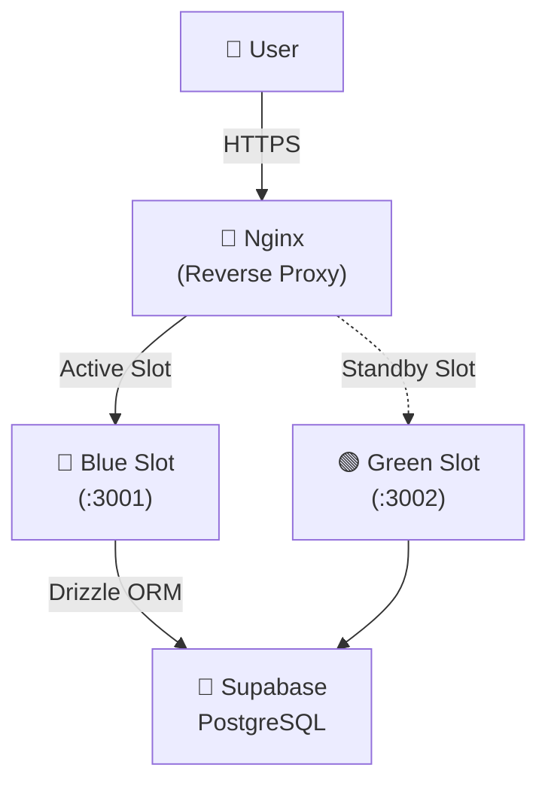

# PromptHub 🚀

**프롬프트 엔지니어링을 위한 프롬프트 공유 및 버전 관리 플랫폼**

공식 홈페이지: [https://prompthub.kro.kr](https://prompthub.kro.kr)

---

## 🌟 개요

PromptHub는 AI 프롬프트를 단순히 공유하는 것을 넘어, **포크(Fork)**와 **버전 관리**를 통해 최적화된 프롬프트를 함께 만들어가는 플랫폼입니다. 개발자뿐만 아니라 일반 사용자도 쉽게 프롬프트를 탐색하고, 자신만의 버전으로 개선할 수 있습니다.

## 🛠 Tech Stack

### Frontend & Backend

- **Framework**: Next.js 15+ (App Router, Turbopack)
- **Language**: TypeScript
- **Styling**: Vanilla CSS (CSS Variables 기반 프리미엄 다크모드)
- **Auth**: Better Auth

### Data & Infrastructure

- **Database**: PostgreSQL (Supabase)
- **ORM**: Drizzle ORM
- **Container**: Docker (Multi-stage build)
- **Server**: AWS EC2 (t3.xlarge)
- **Proxy**: Nginx (Reverse Proxy & Blue/Green Switch)
- **CI/CD**: GitHub Actions

---

## ✨ 주요 기능

- **프롬프트 탐색**: 9개 이상의 다양한 카테고리별 프롬프트 탐색 및 검색
- **포크(Fork) 시스템**: 마음에 드는 프롬프트를 내 저장소로 가져와 수정 및 개선
- **버전 관리**: 프롬프트의 변경 내역을 버전별로 추적하고 관리
- **반응형 UI**: 데스크탑부터 모바일까지 최적화된 고급스러운 다크 모드 UI
- **무중단 배포**: Blue/Green 전략을 통한 사용자 중단 없는 서비스 업데이트

---

## 🏗 아키텍처 & 배포 전략

### Infra Architecture



### 무중단 배포 (Blue/Green)

GitHub Actions를 통해 코드가 push될 때마다 자동으로 빌드 및 배포가 진행됩니다.

1. **GitHub Actions**: Docker 이미지를 빌드하고 GHCR(GitHub Container Registry)에 업로드합니다.
2. **Health Check**: 새 컨테이너가 정상적으로 기동되었는지 `/api/health` 엔드포인트를 통해 확인합니다.
3. **Nginx Switch**: 새로운 버전이 준비되면 Nginx upstream을 전환하여 사용자에게 중단 없이 새 버전을 제공합니다.

---

## 🏃 로컬 개발 가이드

### 환경 변수 설정

`.env` 파일을 생성하고 다음 변수들을 설정합니다.

```env
DATABASE_URL=your_supabase_postgresql_url
NEXT_PUBLIC_APP_URL=http://localhost:3000
BETTER_AUTH_SECRET=your_auth_secret
BETTER_AUTH_URL=http://localhost:3000
```

### 실행

```bash
# 의존성 설치
pnpm install

# 개발 서버 실행
# 의존성 설치
pnpm install

# 개발 서버 실행
pnpm dev

# 빌드 테스트
pnpm build
```

---

## 🧐 Project Topic Selection

**"왜 프롬프트 허브인가?"**
단순히 명령어 한 줄을 공유하는 것을 넘어, **질 좋은 프롬프트는 계속해서 진화해야 한다**는 아이디어에서 시작했습니다.

- 오픈소스의 'Fork' 문화를 프롬프트에 도입하여 집단의 지성으로 프롬프트를 발전시키는 환경을 목표로 했습니다.
- 버전 관리를 통해 과거의 기록을 보존하고, 어떤 변화가 성능 개선을 이끌었는지 추적할 수 있도록 설계했습니다.

---

## 🚀 Case Study: 도전과 해결 (Problem & Solution)

### 1️⃣ Docker 컨테이너 내부 SSR 네트워크 통신 문제

- **Problem**: 배포 환경(Docker)에서 서버 컴포넌트(SSR)가 자신의 API를 호출할 때 `ECONNREFUSED` 에러 발생. (컨테이너 내부에서 외부 IP/localhost 접근의 한계)
- **Solution**: 서버 컴포넌트에서 HTTP fetch 대신 **Drizzle ORM을 이용한 직접 DB 쿼리** 방식으로 전환. 네트워크 레이어를 제거하여 성능 향상 및 신뢰성 확보.

### 2️⃣ Next.js 빌드 시점의 Prerendering 에러

- **Problem**: `useSearchParams`를 사용하는 페이지들이 빌드 타임에 URL 정보가 없어 에러를 발생시키며 배포 실패.
- **Solution**: 해당 컴포넌트들을 `<Suspense>`로 래핑하여 클라이언트 사이드 렌더링(CSR) 시점에 지연 로딩되도록 처리하여 정적 빌드 성공.

### 3️⃣ 무중단 배포를 위한 Blue/Green 전략

- **Problem**: 새로운 버전 배포 시 기존 컨테이너가 종료되며 수 초간 서비스 중단 발생.
- **Solution**: Nginx 리버스 프록시와 두 개의 Docker 슬롯(Blue/Green)을 활용한 배포 스크립트 구축. `/api/health` 체크 통과 시에만 트래픽을 스위칭하는 로직으로 **Zero-Downtime** 달성.

### 4️⃣ DB 커넥션 관리 및 Supabase 제한 대응

- **Problem**: 배포 및 트래픽 증가 시 Supabase 무료 플랜의 동시 접속 수 제한에 걸려 간헐적 쿼리 실패.
- **Solution**: DB 클라이언트의 `Pool` 설정을 최적화(`max: 5`, `idleTimeout`)하여 커넥션 낭비를 방지하고 안정적인 데이터 통신 구현.

### 5️⃣ 복잡한 상속 구조의 포크 전파 버그

- **Problem**: 여러 번 포크된 프롬프트에서 원본 ID가 아닌 중간 버전 ID를 참조하여 포크 트리가 끊기는 현상.
- **Solution**: API에서 재귀적 쿼리를 통해 최상위 루트를 찾고, 클라이언트에서 ID 참조 로직을 명확히 구분하여 견고한 포크 시스템 구축.

---

## 📄 라이선스

Copyright © 2026 PromptHub Team. All rights reserved.
