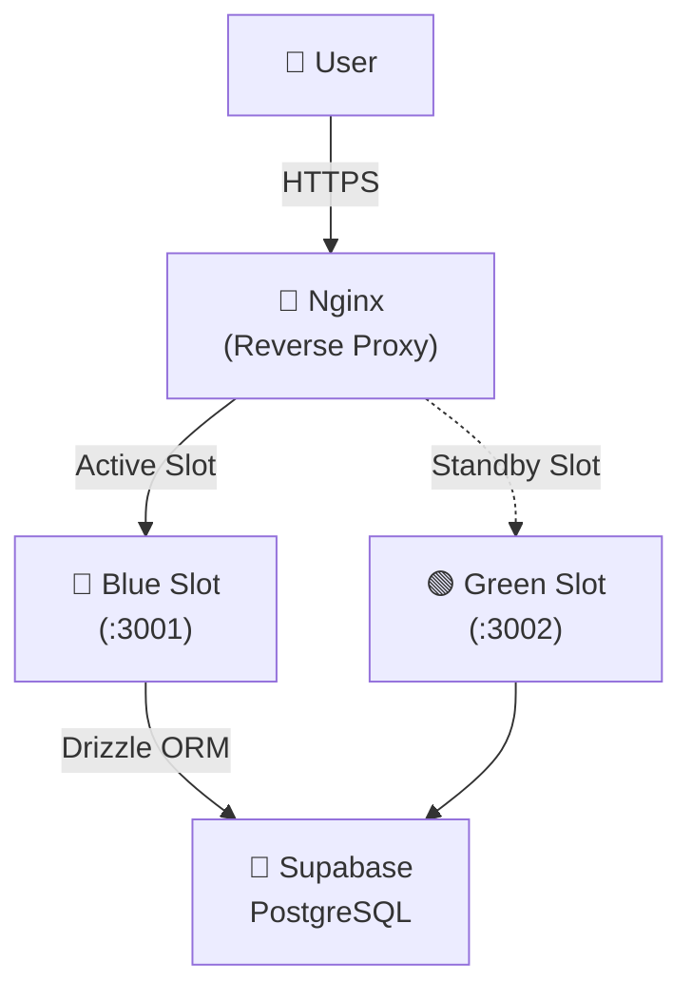

# PromptHub 🚀
**프롬프트 엔지니어링을 위한 프롬프트 공유 및 버전 관리 플랫폼**

공식 홈페이지: [https://prompthub.kro.kr](https://prompthub.kro.kr)

---

## 🌟 개요
PromptHub는 AI 프롬프트를 단순히 공유하는 것을 넘어, **포크(Fork)**와 **버전 관리**를 통해 최적화된 프롬프트를 함께 만들어가는 플랫폼입니다. 개발자뿐만 아니라 일반 사용자도 쉽게 프롬프트를 탐색하고, 자신만의 버전으로 개선할 수 있습니다.

## 🛠 Tech Stack

### Frontend & Backend
- **Framework**: Next.js 15+ (App Router, Turbopack)
- **Language**: TypeScript
- **Styling**: Vanilla CSS (CSS Variables 기반 프리미엄 다크모드)
- **Auth**: Better Auth

### Data & Infrastructure
- **Database**: PostgreSQL (Supabase)
- **ORM**: Drizzle ORM
- **Container**: Docker (Multi-stage build)
- **Server**: AWS EC2 (t3.xlarge)
- **Proxy**: Nginx (Reverse Proxy & Blue/Green Switch)
- **CI/CD**: GitHub Actions

---

## ✨ 주요 기능

- **프롬프트 탐색**: 9개 이상의 다양한 카테고리별 프롬프트 탐색 및 검색
- **포크(Fork) 시스템**: 마음에 드는 프롬프트를 내 저장소로 가져와 수정 및 개선
- **버전 관리**: 프롬프트의 변경 내역을 버전별로 추적하고 관리
- **반응형 UI**: 데스크탑부터 모바일까지 최적화된 고급스러운 다크 모드 UI
- **무중단 배포**: Blue/Green 전략을 통한 사용자 중단 없는 서비스 업데이트

---

## 🏗 아키텍처 & 배포 전략

### Infra Architecture


### 무중단 배포 (Blue/Green)
GitHub Actions를 통해 코드가 push될 때마다 자동으로 빌드 및 배포가 진행됩니다.
1. **GitHub Actions**: Docker 이미지를 빌드하고 GHCR(GitHub Container Registry)에 업로드합니다.
2. **Health Check**: 새 컨테이너가 정상적으로 기동되었는지 `/api/health` 엔드포인트를 통해 확인합니다.
3. **Nginx Switch**: 새로운 버전이 준비되면 Nginx upstream을 전환하여 사용자에게 중단 없이 새 버전을 제공합니다.

---

## 🏃 로컬 개발 가이드

### 환경 변수 설정
`.env` 파일을 생성하고 다음 변수들을 설정합니다.
```env
DATABASE_URL=your_supabase_postgresql_url
NEXT_PUBLIC_APP_URL=http://localhost:3000
BETTER_AUTH_SECRET=your_auth_secret
BETTER_AUTH_URL=http://localhost:3000
```

### 실행
```bash
# 의존성 설치
pnpm install

# 개발 서버 실행
pnpm dev

# 빌드 테스트
pnpm build
```

---

## 📄 라이선스
Copyright © 2026 PromptHub Team. All rights reserved.
